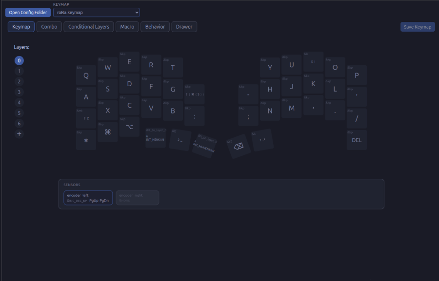
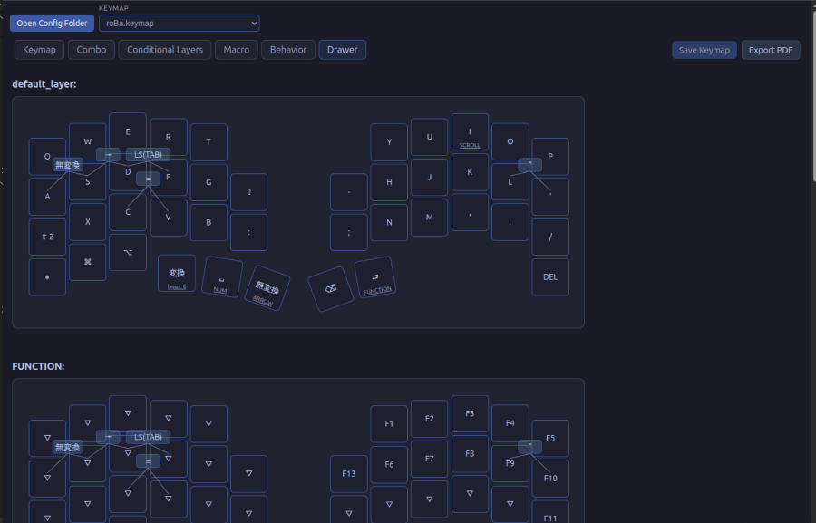

# Keymap Editor

ZMK keymapをブラウザ上で編集するためのアプリです。オリジナルは https://github.com/nickcoutsos/keymap-editor になります。
このforkは、元プロジェクトの`main`ブランチHEAD時点の構成をベースに調整しています。

JIS レイアウトに存在するキーコードを扱えるようにしていることと、後で見返す用の pdf をそのまま出力できることが特徴です。

## Usage
[Keymap Editor (Webブラウザからローカルファイルを読み込む版)]

> 公開先: `https://ihiroky.github.io/keymap-editor/`

Chromium ベースのブラウザでは File System Access API を使ってキーマップなどが定義されている `.keymap` ファイルの編集を行います。 `Open Config Folder` ボタンをクリックするとアクセス許可が求められるので承認後に  `zmk-config-<キーボード名>/config` ディレクトリを指定してください。 `<キーボード名>.keymap` と `<キーボード名>.json` が読み込まれ編集可能な状態になります。

それ以外のブラウザでは `<キーボード名>.keymap` と `<キーボード名>.json` をそれぞれに対応するボタンからダイアログを開き選択してください。

behavior や keycode などの定義をサーバーから取得しますが `<キーボード名>.keymap` の読み書きはローカルで完結するようになっています。

## License

This project is available under the MIT license.
The bundled ZMK keycode definitions are also based on MIT-licensed sources.
